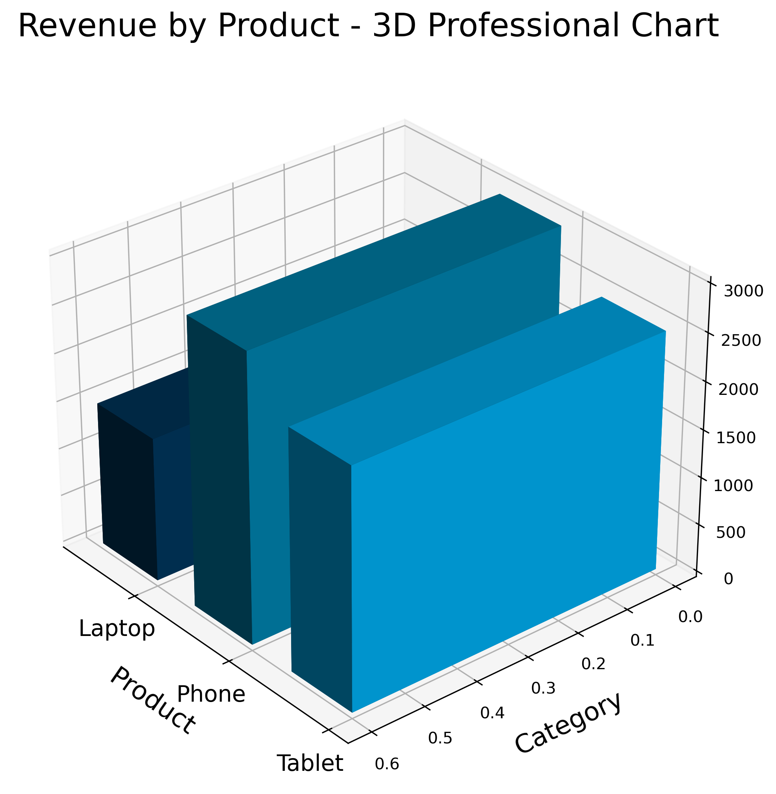

# Sales Data Analysis

This project analysis sales data using Python, Pandas, Matplotlib and professional 3D visualizations.
It includes data cleaning, exploration, revenue calculations, and multiple visula charts.
---

## Project Contents

- `Sales_Data_Analysis.inpynb´ -main notebook containning the analysis
-  `revenue_3d_chart.png´ - 3D chart generated in JupyterLab
-  `salescsv/` - dataset used for the analysis
-  `notecools/` - notes and additional files
-  `Videos/` - video materials (if any)

  ---

  ## 3D Revenue Chart

  The image below shows the 3D revenue chart created in JupyterLab:

 
 
  

  ---

  ##  Included Analysis

  - Loading and cleaning the dataset
  - Exploring the data (head, info, describe)
  - Correlation matrix and heatmaps
  - Calculating revenue
  - Creating 2D and 3D visualizations
  - Exporting charts as PNG files

    ---

    # Technologies Used

    Python 3
    Pandas
    Matplotlib  (including 3D)
    NumPy
    JupyterLab

    ---

    #  Project Goal

    This project was created to practice data analysis, advanced visualizations, and GitHub project structure.

    ---

    # How to Run The Project
    (Englisch  Deutsch  Romana)

    ##   English
    ###   How to Run the Project

    Follow these steps to run the analysis on your machine:

    1. Install Python 3.10 or newer.
    2. Install the required libraries:
    3. Open JupyterLab:
    4. Open the file:
    5. Run all cells to generate the charts, including the 3D revenue charts.
    6. The generated PNG images will appear in the same folder as the notebook.

    ---

    ##  Deutsch
    ###  Projekt ausführen

    Folgen diesen Schritten, um die Analyse lokal auszuführen:

    1. Installiere  Python 3.10 oder neuer.
    2. Instaliere die benötigten Bibliotheken:
    3. Starte JupyterLab
    4. Öffne die Datei:
    5. Führe alle Zellen aus, um die Diagramme zu erzeugen, einschließlich des 3D-Umsatzdiagramms.
    6. Die generierten PNG-Bilder erscheinen im selben Ordner wie das Notebook.
   
    ---

    ##  Romana
    ###  Cum rulezi proiectul

    Urmeaza acesti pasi pentru a rula  analiza pe calculatorul tau:

    1. Instaleaza Python 3.10 sau mai nou.
    2. Instaleaza bibliotecile necesare:
    3. Deschide JupyterLab
    4. Deschide fisierul:
    5. Ruleaza toate celulele pentru a genera graficele, inclusiv graficul 3D.
    6. Imaginile PNG generate vor aparea in acelasi folder cu notebook-ul.

    ---

    ##   Author

    Project created by  **Ion3135**.
